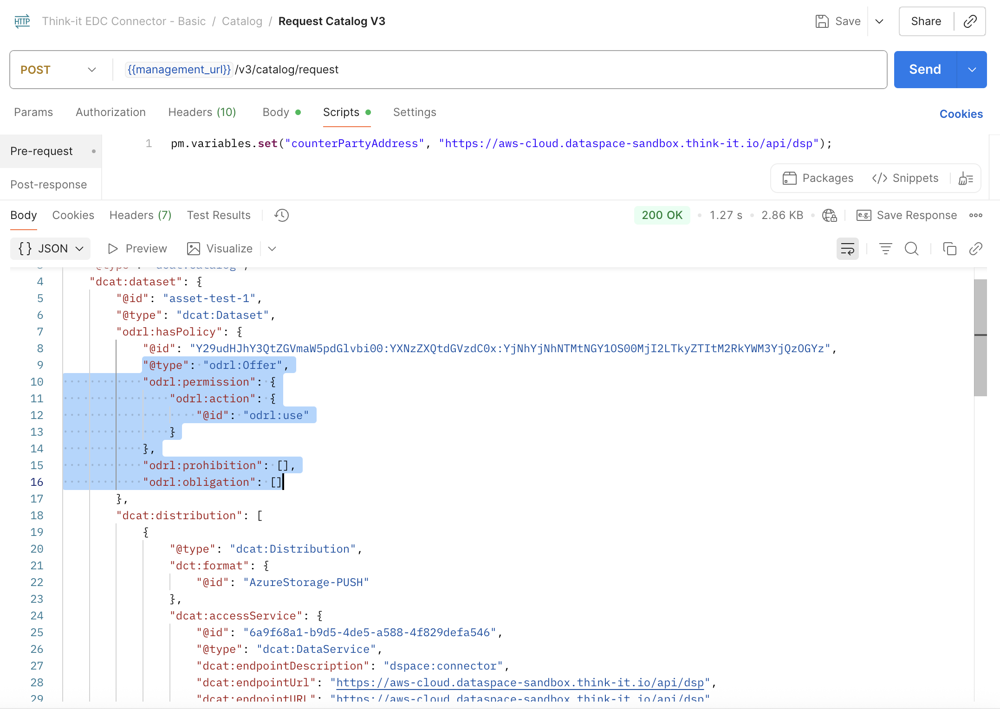
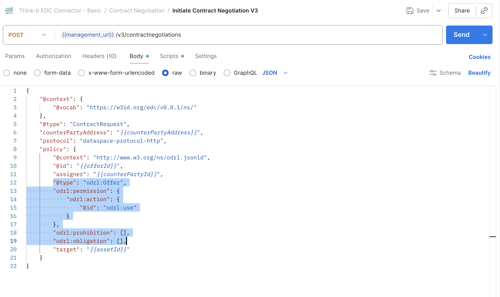
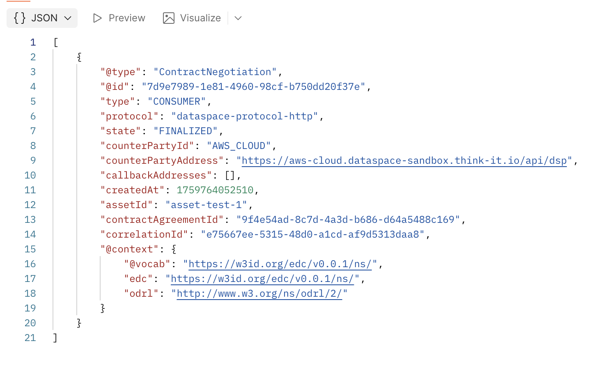
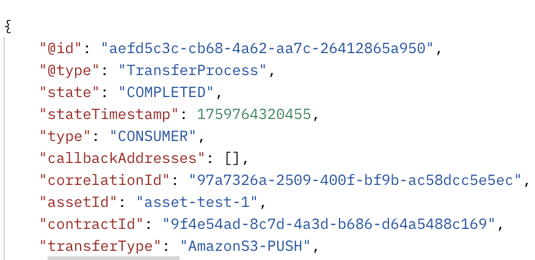
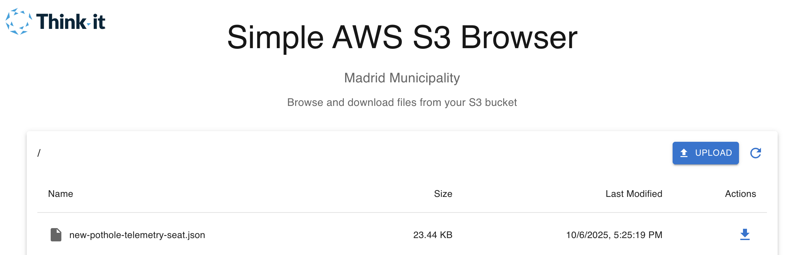

# Think-it Dataspaces Demonstrator Sandbox

Think-it Sandbox Environment on AWS for Data Spaces Demonstrators.

## Lab Phases

- Phase 1: Secure and sovereign integration of internal data systems to the data space
- Phase 2: Discovery & Assessment
- Phase 3: Contract Negotiation & Agreement
- Phase 4: Data Transfer & Integration

## Lab Participants

| Lab Persona                                   | Participant ID          | Connector Protocol API                                              |
|-----------------------------------------------|-------------------------|---------------------------------------------------------------------|
| City of Madrid - Urban Infrastructure Manager | MADRID_MUNICIPALITY     | https://madrid-municipality.dataspace-sandbox.think-it.io/api/dsp   |
| SEAT - Automotive Innovation Leader           | CAR_MANUFACTURER_1      | https://car-manufacturer-1.dataspace-sandbox.think-it.io/api/dsp    |
| Renault - Strategic Mobility Partner          | CAR_MANUFACTURER_2      | https://car-manufacturer-2.dataspace-sandbox.think-it.io/api/dsp    |
| EMT Madrid - Public Transport Authority       | EMT_MADRID              | https://emt-madrid.dataspace-sandbox.think-it.io/api/dsp            |
| Madrid Road Maintenance Company               | ROADS_COMPANY_SL        | https://roads-company-sl.dataspace-sandbox.think-it.io/api/dsp      |
## Lab Guide and Instructions

### Configuring Postman to Interact with the Connector

#### Import the Collection

- Navigate to the `collections/Postman/` directory.
- Import the `Think-it EDC Connector - Basic.json` file into Postman.

#### Set Up the Base URL of your Connector

- Define the `base_url` variables in your Postman environment. The base URL of your connector's HTTP API.

#### Authentication

- Ensure that the necessary authentication header `api_key` is configured in the Postman collection.

#### Testing the Connector Endpoints

- Use the provided requests to interact with the connector.

### Phase 1: Secure and sovereign integration of internal data systems to the data space

> Learning Objective: Understand how to register and publish data offers in a data space

#### Mission Brief

> Before you can participate in the data space ecosystem, you need to contribute value to the network. Your organization has valuable pothole data that other partners need for their route planning and road maintenance. Register your data assets to make them discoverable and establish your organization as a trusted data provider in the network.

#### Quest Tasks

##### Review your organization's available datasets (provided as mock data)

Using the Think-it Simple AWS S3 Browser, download and view the data available to your company.

##### Register data assets with metadata for discoverability

With Postman, use the `Create Asset V3` request:

- Update `@id` with your unique asset identifier
- Update `properties` section with descriptive metadata (title, description, organization)
- Configure the `dataAddress` section with your S3 bucket information:

```json
"dataAddress": {
    "type": "AmazonS3",
    "objectName": "your-data-file.json",
    "region": "<REPLACE WITH THE BUCKET REGION>",
    "bucketName": "<REPLACE WITH THE SOURCE BUCKET NAME>",
    "accessKeyId": "<REPLACE WITH YOUR ACCESS KEY ID>",
    "secretAccessKey": "<REPLACE WITH SECRET ACCESS KEY>"
}
```

##### Configure a basic access policy for your data offer

With Postman, use the `Create Policy Definition V3` request:

- In the Pre-request Script tab, set the `policyId` variable (e.g., `policy-1`)
- The default request body already includes the permission structure with "use" action and empty constraints. It allows the usage without restrictions.
- Send the request and save the policy ID for the next step

##### Create a contract definition (data offer) using the policy ID that you created

With Postman, use the `Create Contract Definition V3` request:

- In the Pre-request Script tab, configure:
  - `definitionId`: Your contract definition ID (e.g., `contract-definition-1`)
  - `accessPolicyId`: The policy ID from step 4
  - `contractPolicyId`: The policy ID from step 4

This creates a contract that allows access to my datasets with no restrictions.

##### Validate successful registration by checking your own catalog publication

Use the `Request Catalog V3` request:

- In the Pre-request Script tab, set `counterPartyAddress` to your own DSP endpoint: `https://your-company.dataspace-sandbox.think-it.io/api/dsp`
- Send the request and verify your asset appears in the catalog response

### Phase 2: Discovery & Assessment

> Learning Objective: Understand data space catalog discovery and asset identification

#### Mission Brief

> Your team has identified 4 key supplier categories (2 car manufacturers, the municipality of Madrid, EMT Madrid and the road maintenance company) that have relevant data. Time to discover what data is actually available in the data space network.

#### Quest Tasks

##### Identify partner organizations to query for available datasets

Review the list of participants in the data space network and note their DSP endpoint URLs (e.g., `https://partner-company.dataspace-sandbox.think-it.io/api/dsp`).

##### Discover available data catalogs from partner organizations

With Postman, use the `Request Catalog V3` request:

- In the Pre-request Script tab, set `counterPartyAddress` to the target connector's DSP endpoint
- Send the request to fetch the partner's catalog
- Repeat for each partner organization you want to discover their catalog of offers

##### Review catalog responses and identify relevant datasets

For each catalog response:

- Examine the available datasets and their metadata (title, description, properties)
- Note the `@id` field of datasets you're interested in (you'll need this for negotiation)
- Review the `odrl:hasPolicy` section to understand usage requirements and constraints

##### Document your findings across all partner catalogs

Create a summary of:

- Which partners have relevant datasets for your use case
- The asset IDs and offer IDs you plan to negotiate
- Any policy constraints that might affect your usage

### Phase 3: Contract Negotiation & Agreement

> Learning Objective: Master data usage agreements and sovereignty controls

#### Mission Brief

> Legal compliance requires that all supplier data used in your report must have clear usage agreements, audit trails, and purpose limitations. Your legal team has provided specific policy requirements that must be embedded in all data sharing contracts.

#### Quest Tasks

##### Initiate contract negotiations with at least 1 data provider

With Postman, use the `Initiate Contract Negotiation V3` request:

- In the Pre-request Script tab, configure the following variables:
  - `counterPartyAddress`: Provider's DSP endpoint (e.g., `https://provider.dataspace-sandbox.think-it.io/api/dsp`)
  - `counterPartyId`: Provider's participant ID (found in catalog response)
  - `offerId`: The offer ID from the catalog (format: `assetId:policyId:definitionId`)
  - `assetId`: The asset ID you want to access
- In the request body, update the `policy` section by copying the **exact policy** from the provider's catalog response that you received in the previous step





- Ensure the policy's `@id`, `assigner`, and `target` fields match the catalog offer
- Send the request and save the returned `negotiationId` from the response

##### Monitor the contract negotiation status until finalized

With Postman, use the `Get Negotiation State V3` request:

- In the Pre-request Script tab, set `negotiationId` to the ID from the previous step
- Send the request repeatedly (every few seconds) to monitor the negotiation progress
- Wait until the state becomes `FINALIZED`



##### Retrieve the agreement ID for data transfer

Once the negotiation is finalized:

- Note the `agreementId` from the response (needed for data transfer in Phase 4)
- You can also use the `Get Agreement For Negotiation V3` request if needed to retrieve the agreement ID later

### Phase 4: Data Transfer & Integration

> Learning Objective: Execute secure, sovereign data transfers

#### Mission Brief

> Contracts are signed, policies are in place. Now execute the actual data transfer(s). Your CFO wants to see real numbers, not just promises.

#### Quest Tasks

##### Initiate the data transfer process

With Postman, use the `Create Transfer Process V3` request:

- In the Pre-request Script tab, configure:
  - `counterPartyAddress`: Provider's DSP endpoint (same as used in negotiation)
  - `contractId`: The agreement ID obtained from the finalized negotiation (use `Get Agreement For Negotiation V3` if needed)
  - `transferType`: Set to `AmazonS3-PUSH`
- In the request body, add the following data destination to receive data on your S3 Bucket:

```json
"dataDestination": {
    "type": "AmazonS3",
    "objectName": "your-destination-data-filename",
    "region": "<REPLACE WITH THE BUCKET REGION>",
    "bucketName": "<REPLACE WITH THE SOURCE BUCKET NAME>",
    "accessKeyId": "<REPLACE WITH YOUR ACCESS KEY ID>",
    "secretAccessKey": "<REPLACE WITH SECRET ACCESS KEY>"
}
```

- Send the request and save the returned `transferProcessId`

##### Monitor the transfer process until completion

With Postman, use the `State Transfer Process V3` request:

- In the Pre-request Script tab, set the `transferProcessId` from the previous step
- Send the request repeatedly (every few seconds) to monitor the transfer state. Wait until the transfer state becomes `COMPLETED`



##### Verify the transferred data in your S3 bucket

Once the transfer is completed:

- Visit the Think-it AWS Simple S3 Browser application of your organization's bucket
- Verify that the data file appears in the expected location



##### Inspect the received data and share insights

Download and review the transferred data:

- Review the data structure and content
- Discuss with your team:
  - What data did you receive and how does it align with the catalog description?
  - What challenges did you encounter during the data space workflow?
  - How could this data be integrated with your organization's systems?
