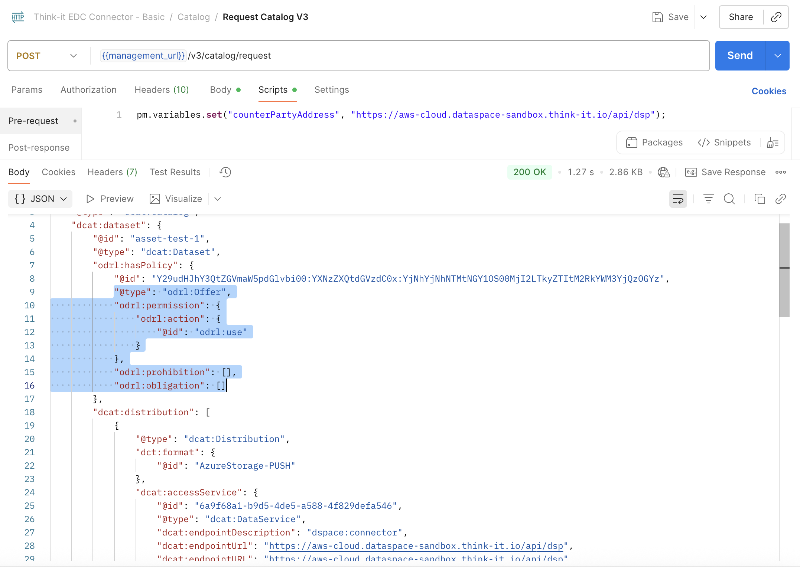
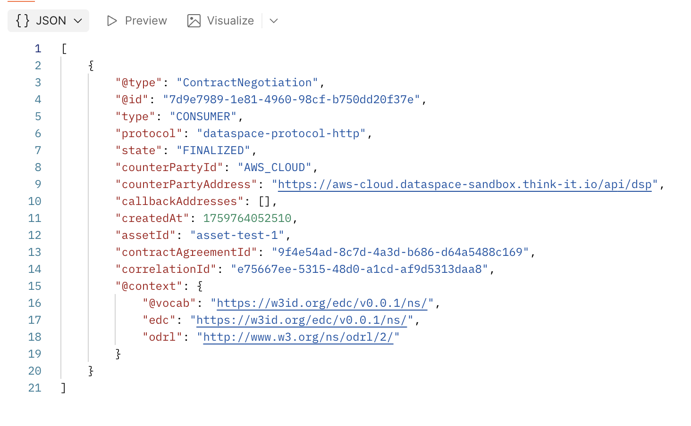

# Phase 3: Contract Negotiation & Agreement

> Learning Objective: Master data usage agreements and sovereignty controls

## Mission Brief

Legal compliance requires that all supplier data used in your report must have clear usage agreements, audit trails, and purpose limitations. Your legal team has provided specific policy requirements that must be embedded in all data sharing contracts.

## Quest Tasks

### Initiate contract negotiations with at least 1 data provider

With Postman, use the `Initiate Contract Negotiation V3` request:

- In the Pre-request Script tab, configure the following variables:
  - `counterPartyAddress`: Provider's DSP endpoint (e.g., `https://provider.dataspace-sandbox.think-it.io/api/dsp`)
  - `counterPartyId`: Provider's participant ID (found in catalog response)
  - `offerId`: The offer ID from the catalog (format: `assetId:policyId:definitionId`)
  - `assetId`: The asset ID you want to access
- In the request body, update the `policy` section by copying the **exact policy** from the provider's catalog response that you received in the previous step

- Ensure the policy's `@id`, `assigner`, and `target` fields match the catalog offer
- Send the request and save the returned `negotiationId` from the response

### Monitor the contract negotiation status until finalized

With Postman, use the `Get Negotiation State V3` request:

- In the Pre-request Script tab, set `negotiationId` to the ID from the previous step
- Send the request repeatedly (every few seconds) to monitor the negotiation progress
- Wait until the state becomes `FINALIZED`

### Retrieve the agreement ID for data transfer

Once the negotiation is finalized:

- Note the `agreementId` from the response (needed for data transfer in Phase 4)
- You can also use the `Get Agreement For Negotiation V3` request if needed to retrieve the agreement ID later
